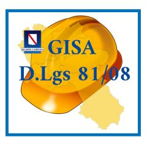
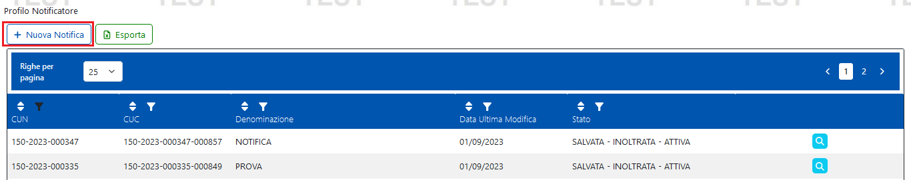
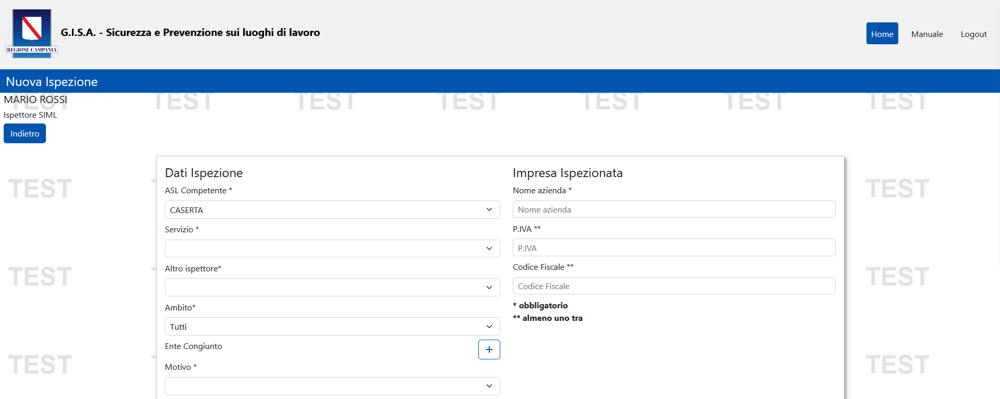
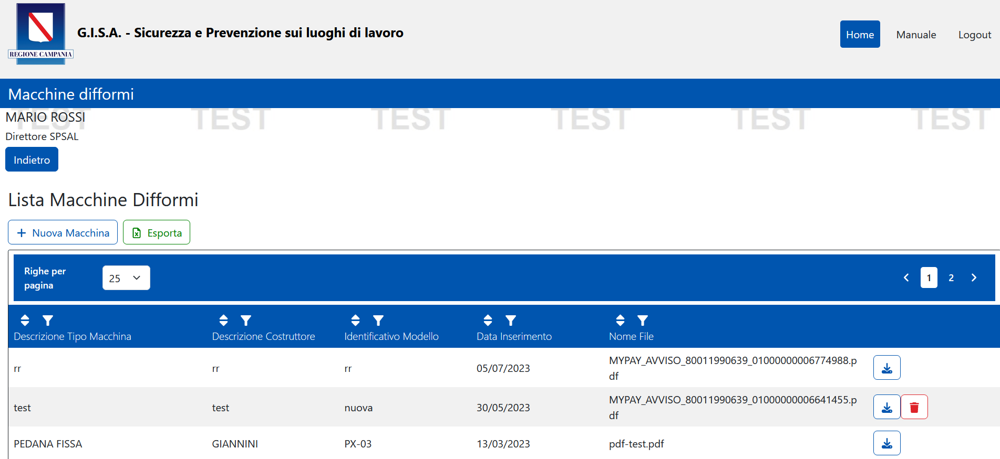
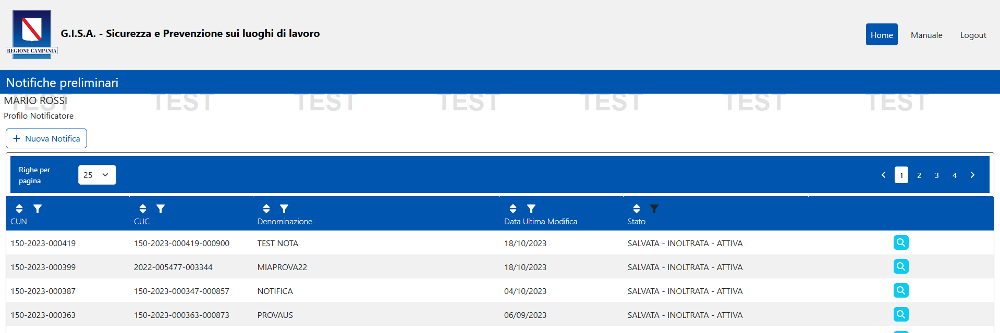
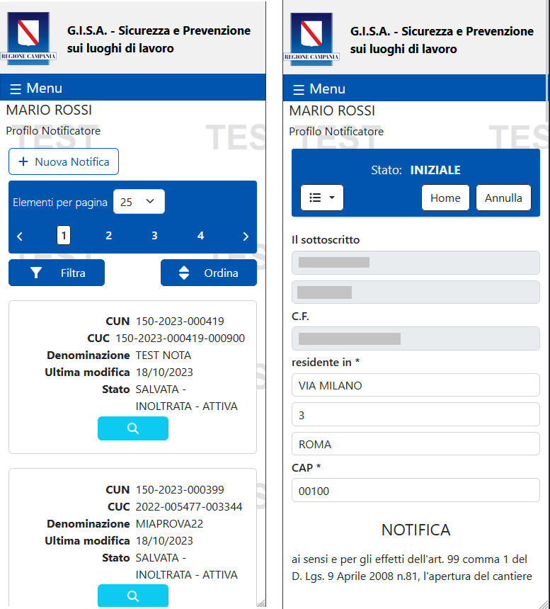

# G.I.S.A. Sicurezza e Prevenzione sui luoghi di lavoro
- [1. Descrizione e finalità del software](#1-descrizione-e-finalità-del-software)
  - [1.1 Descrizione della struttura repository](#11-descrizione-della-struttura-repository)
  - [1.2 Contesto di utilizzo e casi d'uso](#12-contesto-di-utilizzo-e-casi-duso)
  - [1.3 Piattaforme abilitanti](#13-piattaforme-abilitanti)
  - [1.4 Interoperabilità con i sistemi esterni](#14-interoperabilità-con-i-sistemi-esterni)
  - [1.5 Link a pagine istituzionali relative al progetto](#15-link-a-pagine-istituzionali-relative-al-progetto)
  - [1.6 Interfaccia web](#16-interfaccia-web)
- [2. Licenza](#2-licenza)
  - [2.1 GISA Prevenzione e Sicurezza sui luoghi di lavoro](#21-gisa-prevenzione-e-sicurezza-sui-luoghi-di-lavoro)
  - [2.2 Indirizzo e-mail segnalazioni di sicurezza](#22-indirizzo-e-mail-segnalazioni-di-sicurezza)
  - [2.3 Titolarità: Regione Campania](#23-titolarità-regione-campania)

# **1. Descrizione e finalità del software**
GISA Prevenzione e sicurezza sui Luoghi di Lavoro è un software open source di titolarità della Regione Campania che fa parte dell’Ecosistema software **G.I.S.A. Sicurezza e Prevenzione sui luoghi di lavoro**.
Viene fornito nella modalità PWA, che permette di scaricare l’applicativo direttamente sul proprio dispositivo e accedervi direttamente dalla lista applicazioni. Questa funzionalità rende l’app completamente compatibile con tutti i moderni dispositivi, sia Android che iOS.
Nell’ottica della “Burocrazia zero”, della semplificazione e della digitalizzazione dei processi della Pubblica Amministrazione, **G.I.S.A. Sicurezza e Prevenzione sui luoghi di lavoro** è composto dai seguenti tre moduli funzionali:

***1) Gestione Notifiche Preliminari.***.

Consente la gestione delle Notifiche Preliminari, ai sensi dell’Art. 99 Capo I del D. Lgs. 81/08. Esso può essere utilizzato:

**dal Committente o dal Responsabile dei lavori** del Cantiere con personale superiore a tre lavoratori
che, in accordo all’Art. 99 Capo I del D. Lgs. 81/08 e attraverso una web application utilizzabile anche da smartphone, può compilare on line la notifica preliminare dell’apertura del Cantiere e inviarla automaticamente, previo accordo e opportuna configurazione, agli organi di vigilanza competenti in materia: le AA.SS.LL. e l’Ispettorato del Lavoro;

**dall’ASL e dall’Ispettorato del Lavoro** territorialmente competenti,
per conoscere in tempo reale le Notifiche Preliminari di apertura dei Cantieri al fine di facilitare e digitalizzare il monitoraggio e lo svolgimento delle attività ispettive, di vigilanza e di prevenzione di competenza;

**dalla Regione**
per poter disporre di un cruscotto atto a semplificare le proprie attività istituzionali;

**dagli Enti Bilaterali (Comitati Paritetici e Casse Edili),**
che potrebbero conoscere in tempo reale le notifiche preliminari effettuate con conseguenti vantaggi nelle verifiche di congruità assicurative e contributive (DURC) e nel contrasto in maniera più efficace del lavoro irregolare nel settore edile (Legge Regionale n. 6 del 2016, art. 21).

 

Figura 1.  **Notifiche preliminari** 

***2) Gestione del Ciclo Ispettivo.***.

Consente la gestione dell’intero ciclo ispettivo, ai sensi del D. Lgs. 81/08. 
Gli ispettori delle Autorità Competenti possono verificare in tempo reale:

    • l’effettivo invio “obbligatorio” delle notifiche preliminari; 
	
    • possono compilare e memorizzare i verbali ispettivi e la documentazione a corredo; 
	
    • in caso di ammende possono gestire con elevata semplicità la generazione automatica degli avvisi di pagamento PagoPA, la loro memorizzazione e le verifiche in tempo reale delle scadenze e dei pagamenti effettuati grazie all’integrazione con PagoPa.
	
  

   Figura 2.  **Ispezioni** 

Questo modulo fornisce anche un app di generazione degli avvisi di Pagamento PagoPA da poter associare successivamente al verbale digitalizzato.
I direttori Servizio Igiene e Medicina del Lavoro (SIML) e Servizio prevenzione e Sicurezza Ambienti di Lavoro (SPSAL) e la regione, a seconda delle competenze e delle opportune     profilazioni, possono effettuare monitoraggi ed estrazione di reportistica.
 

 

Figura 3.  **PagoPa** 

***3) Registro delle Macchine difformi.***.

Consente la generazione e gestione del registro regionale delle macchine difformi.

Figura 4.  **Registro macchine difformi_home** 

Figura 3.  **Registro macchine difformi_home** 

Giacchè il sistema è composto da moduli software autoconsistenti integrati è possibile anche acquisire in riuso i singoli moduli: 

  • modulo funzionale Gestione Notifiche Preliminari, 

  • modulo funzionale Gestione ciclo ispettivo, 

  • modulo funzionale Registro Macchine Difformi, 

  • App PagoPA.
  
  

## **1.1 Descrizione della struttura repository**

Ogni cartella del repository ha questa struttura:

  - _./app_pagoPa_   sorgenti e struttura di cartelle della piattaforma 

  - _./ispezioni_   sorgenti e struttura di cartelle della piattaforma 
  
  - _./macchine_difformi_    sorgenti e struttura di cartelle della piattaforma 

- _./modulo_registrazione_spid_cie_    sorgenti e struttura di cartelle della piattaforma 

- _./gestione_utenti_    sorgenti e struttura di cartelle della piattaforma 

- _./notifiche_preliminari_    sorgenti e struttura di cartelle della piattaforma 

- _./docs_       documentazione varia (cartella contenente file integrati nel readme: immagini, diagrammi, ecc.)  

## **1.2 Contesto di utilizzo e casi d'uso**

 Il contesto di utilizzo e casi d'uso del Software sono descritti dettagliatamente nella [guida utente ispezione](https://gisasicurezzalavoro-coll.regione.campania.it/assets/Manuale_GISA_Sicurezza_Lavoro_Ispezioni.pdf) e [guida utente notifiche](https://gisasicurezzalavoro-coll.regione.campania.it/assets/Manuale_GISA_Sicurezza_Lavoro.pdf)
 
## **1.3 Piattaforme abilitanti**

Le piattaforme abilitanti sono:
    - **Autenticazione SPID/CIE**
	
## **1.4 Interoperabilità con i sistemi esterni**

1. **SPID / CIE è Regione Campania**
	

## **1.5 Link a pagine istituzionali relative al progetto**

- [GISA Prevenzione e Sicurezza sui luoghi di lavoro](https://gisasicurezzalavoro.regione.campania.it)

## **1.6 Interfaccia web**

**GISA Prevenzione e Sicurezza sui luoghi di lavoro** è dotato di un interfaccia web semplice e intuitiva.
Questa la form di creazione notifica: 

Figura 5. Rappresentazione form notifica

Figura 6. Form notifiche da mobile

# **2. Licenza**

## **2.1 GISA Prevenzione e Sicurezza sui luoghi di lavoro**

Stato Software : Stabile

**Soggetti incaricati del mantenimento del progetto open source**

U.S. s.r.l. 
## **2.2 Indirizzo e-mail segnalazioni di sicurezza**
Ogni segnalazione di eventuali problemi di sicurezza o bug relativo al software presente in questo repository, va segnalato unicamente tramite e-mail agli indirizzi presente nel file security.txt disponibile a questo [link](http://www.gisacampania.it/.well-known/security.txt)

NOTA: Le segnalazioni non vanno inviate attraverso l'issue tracker pubblico ma devono essere inviate confidenzialmente agli indirizzi e-mail presenti nel security.txt.

Lo strumento issue tracker può essere utilizzato per le richieste di modifiche necessarie per implementare nuove funzionalità.

## **2.3 Titolarità: [Regione Campania](http://www.regione.campania.it/)**
Concesso in licenza a norma di: **AGPL versione 3**;

E' possibile utilizzare l'opera unicamente nel rispetto della Licenza.

Una copia della Licenza è disponibile al seguente indirizzo: <https://www.gnu.org/licenses/agpl-3.0.txt>

**NOTE:**

In caso di riuso, in toto o in parte di GISA Prevenzione e Sicurezza sui luoghi di lavoro, è necessario notificare l'adozione in riuso tramite l'apertura di un ticket (o analogo meccanismo quale una pull request) in questo repository. Inoltre, al contempo per gli aspetti organizzativi utili a potenziare i benefici derivanti dalla pratica del riuso tra PP.AA., come la partecipazione alla **Cabina di regia** per la condivisione di eventuali modifiche/integrazioni o innovazioni, è necessario darne tempestiva comunicazione alle seguenti e-mail:

[paolo.sarnelli@regione.campania.it]() 

[cinzia.matonti@regione.campania.it]()	

Gli enti che aderiscono al riuso di GISA entreranno a far parte della Cabina di Regia per condividere e partecipare all'evoluzione di GISA insieme alle altre PP.AA.