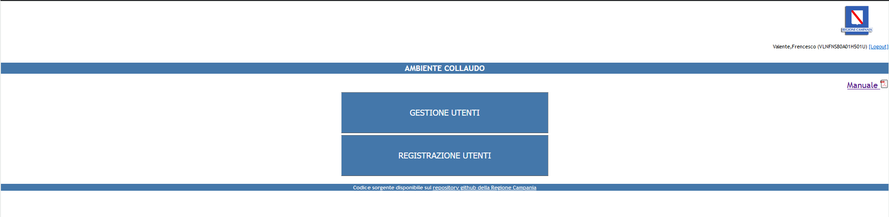
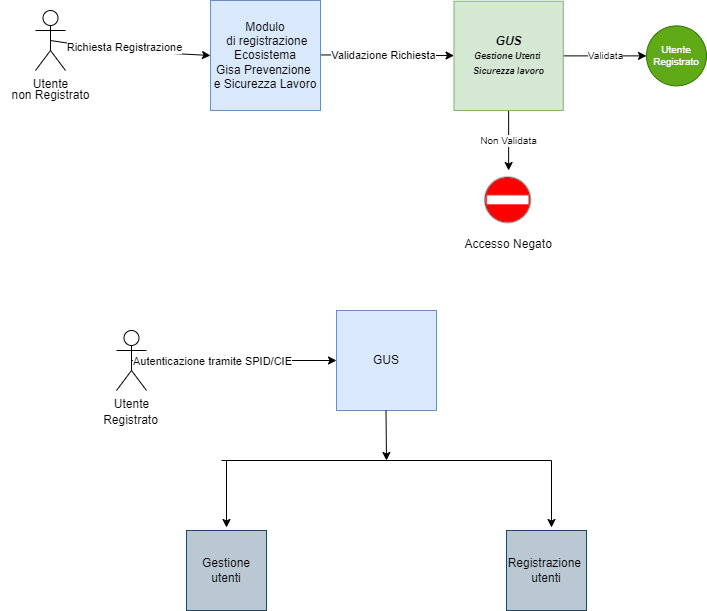

<p align="center">

</p>

# Gestione Utenti - G.I.S.A. Sicurezza e Prevenzione sui luoghi di lavoro


- [1. Descrizione e finalità del software](#1-descrizione-e-finalità-del-software)
  - [1.1 Descrizione della struttura repository](#11-descrizione-della-struttura-repository)
  - [1.2 Contesto di utilizzo e casi d’uso](#12-contesto-di-utilizzo-e-casi-duso)
  - [1.3 Piattaforme abilitanti](#13-piattaforme-abilitanti)
  - [1.4 Interoperabilità con i sistemi esterni](#14-interoperabilità-con-i-sistemi-esterni)
  - [1.5 Interoperabilità con i sistemi interni](#15-interoperabilità-con-i-sistemi-interni)
  - [1.6 Link a pagine istituzionali relative al progetto](#16-link-a-pagine-istituzionali-relative-al-progetto)
  - [1.7 Interfaccia web](#17-interfaccia-web)
- [2. Architettura del software](#2-architettura-del-software)
  - [2.1 Descrizione delle directory](#21-descrizione-delle-directory)
- [3. Requisiti](#3-requisiti)
  - [3.1 Tecnologie utilizzate lato server](#31-tecnologie-utilizzate-lato-server)
  - [3.2 Tecnologie utilizzate lato client](#32-tecnologie-utilizzate-lato-client)
- [4. Riuso ed installazione](#4-riuso-ed-installazione)
  - [4.1 Build dai sorgenti](#41-build-dai-sorgenti)
  - [4.2 Riuso nell’ambito della stessa regione](#42-riuso-nellambito-della-stessa-regione)
  - [4.3 Riuso per enti di altre regioni](#43-riuso-per-enti-di-altre-regioni)
  - [4.4 Librerie esterne](#44-librerie-esterne)
  - [4.5 Creazione e import database](#45-creazione-e-import-database)
  - [4.6 Templates configurazione](#46-templates-configurazione)
  - [4.7 Installazione in un ambiente di sviluppo](#47-Installazione-in-un-ambiente-di-sviluppo)
  - [4.8 Installazione in un ambiente di produzione](#48-Installazione-in-un-ambiente-di-produzione)
- [5. Configurazione](#5-configurazione)
  - [5.1 Configurazione web.xml](#51-configurazione-webxml)
  - [5.2 Configurazione datasource.xml](#52-configurazione-datasourcexml)
  - [5.3 Configurazione context.xml](#53-configurazione-contextxml)
  - [5.4 Configurazione server.xml](#54-configurazione-serverxml)
  - [5.5 Prima dell'avvio applicativo](#55-prima-dellavvio-applicativo)
- [6. Licenza](#6-licenza)
  - [6.1 gus - Gestione Utenti ](#61-gus---gestione-utenti)
  - [6.2 Indirizzo e-mail segnalazioni di sicurezza](#62-indirizzo-e-mail-segnalazioni-di-sicurezza)
  - [6.3 Titolarità: Regione Campania](#63-titolarità-regione-campania)


# **1. Descrizione e finalità del software**

Per **G.I.S.A. Sicurezza e Prevenzione sui luoghi di lavoro**  è prevista una fase di pre-registrazione e registrazione che consente la profilazione dell’utente e lo autorizza all’accesso al sistema dopo l’autenticazione con SPID/CIE.
Di seguito il dettaglio:

1. FASE DI PRE-REGISTRAZIONE: l’utente compila il modulo disponibile on-line (modulo_registrazione_spid_cie)
	
2. FASE DI REGISTRAZIONE: consiste nella validazione e autorizzazione della richiesta pervenuta da parte del soggetto responsabile dell’utente richiedente che dovrà inviare una mail alla PEC: registrazione.gisa@pec.regione.campania.it (GUS)
	
Per l’accesso autorizzato e autenticato all’Ecosistema sono necessari i componenti  **GUS**.
L’utente può accedere ai vari sistemi solo tramite **SPID/CIE** e solo se autorizzato.

## **1.1 Descrizione della struttura repository**


  - _./database_   script sql per la creazione della struttura del DB 

  - _./docs_       documentazione varia (cartella contenente file integrati nel readme: immagini, diagrammi, ecc.) 

  - _./lib_       librerie esterne (nel caso di librerie di terze parti conformi alla licenza AGPL 3)

  - _./templates_   file template per la configurazione del sistema

  - _./gus_    sorgenti e struttura di cartelle della piattaforma 


## **1.2 Contesto di utilizzo e casi d’uso**

Il contesto di utilizzo e casi d'uso del software sono descritti dettagliatamente nella [guida utente](https://gisasicurezzalavoro.regione.campania.it/gestione-utenti/jsp/validazione/giuda_utente_GUS_rev1.pdf)
 
 
  ## **1.3 Piattaforme abilitanti**

Le piattaforme abilitanti sono:
    - **Autenticazione SPID/CIE**
 
 ## **1.4 Interoperabilità con i sistemi esterni**

1. **SPID / CIE Regione Campania**

## **1.5 Interoperabilità con i sistemi interni**

1. **Notifiche preliminari**
2. **Ispezioni**
3. **Macchine difformi**


La cooperazione applicativa interna di ***G.I.S.A. Sicurezza e Prevenzione sui luoghi di lavoro*** avviene invece mediante ***microservices*** o ***DBI*** (***DataBase Interface***).


## **1.6 Link a pagine istituzionali relative al progetto**

- [GUS](https://gisasicurezzalavoro.regione.campania.it/gestione-utenti/index.jsp)

## **1.7 Interfaccia web**

gus è dotato di un interfaccia web semplice ma molto dettagliata.
Si presenta in questo modo: 



Figura 1. Home dell'applicativo


# **2. Architettura del software**

L'architettura software cioè l'organizzazione di base del sistema, espressa dalle sue componenti, dalle relazioni tra di loro e con l'ambiente, e i principi che ne guidano il progetto e l'evoluzione è descritto tramite le immagini seguenti:




Figura 2. Organizzazione di base di GUS


Rappresentazione del flusso di fruizione: percorso di navigazione e relazioni tra contenuti


## **2.1 Descrizione delle directory**  

La struttura sotto la cartella dei file sorgenti _./gus_ è una struttura tipica di un [app Tomcat](https://docs.oracle.com/cd/E19226-01/820-7627/bnadx/index.html)

# **3. Requisiti**

## **3.1 Tecnologie utilizzate lato server**

 - [Apache Tomcat 8.x](https://tomcat.apache.org/download-80.cgi) 
 - [jdk 1.8.x](https://www.oracle.com/it/java/technologies/javase/javase8u211-later-archive-downloads.html)
 - [Postgres  15.x ](https://www.postgresql.org/about/news/postgresql-15-released-2526/)
 - [git](https://git-scm.com/downloads)
 - [ant](https://ant.apache.org/bindownload.cgi)
 - Ambiente di sviluppo per compilazione di progetti Java EE (o come si chiamava prima della versione 5,  Java 2 Enterprise Edition o J2EE) 

## **3.2 Tecnologie utilizzate lato client** 

- [Windows](https://www.microsoft.com/it-it/software-download/) (dalla versione 10 in poi)
- [Mozilla Firefox 99.0.1](https://www.mozilla.org/it/firefox/new/) (Browser Certificato)


# **4. Riuso ed installazione**
 


## **4.1 Build dai sorgenti**

Tecnicamente **GUS** è un'applicazione in architettura web sviluppata con la tecnologia ***Java EE*** secondo il pattern _MVC_ (model view controller).

Come le applicazioni di questo genere Gus è quindi composta da un back-end in funzione di _Model_ (in questo caso l'_RDBMS_ Postgresql) 
una serie di risorse di front-end web (pagine _HTML_, _CSS_, immagini, ecc.) in funzione di _View_
e infine, in funzione di _Controller_, le classi _java_ componenti le _servlet_ in esecuzione sul _servlet container_ (in questo caso Tomcat). 
    
Come risultato del build, tutti i componenti (in formato compilato per le classi java, in formato nativo gli altri elementi) saranno inclusi 
in un unico archivio per il _deploy_ . 


 
## **4.2 Riuso nell’ambito della stessa regione**

Nell’ottica del risparmio e della razionalizzazione delle risorse è opportuno che gli enti che insistono sullo stesso territorio regionale utilizzino la modalità **Multi-Tenant** al fine di installare un unico sistema a livello regionale.


## **4.3 Riuso per enti di altre regioni**

Al fine di avvalersi dei benefici del riuso così come concepito dal **CAD** si chiede di notificarlo come indicato nel paragrafo 6.3 al fine di evitare sprechi e frammentazioni.

*Nota: Se lo scopo è avviare un processo di sviluppo per modificare la propria versione di gus, potrebbe essere il caso di generare prima un proprio fork su GitHub e quindi clonarlo.*

Eseguire il seguente comando:

    git clone \
		  --depth 1  \
		  --filter=blob:none  \
		  --sparse \
		  https://github.com/regione-campania/Gisa_Prevenzione_e_Sicurezza_Lavoro \
		;
		cd Gisa_Prevenzione_e_Sicurezza_Lavoro
		git sparse-checkout set gestione_utenti

Sarà creata la directory gus. Da qui in avanti si farà riferimento a questa directory chiamandola "directory base".

## **4.4 Librerie esterne**

Come tutte le applicazioni complesse, GUS utilizza un elevato numero di librerie in buona parte autocontenute a livello di repository, presenti nel file _build_lib.tar_ nella directory _./lib_.


La configurazione di partenza, modificabile agendo a livello del _build.xml_ sulla variabile _tom.dir_  è:

 _tom.dir=/usr/share/tomcat_
 
 Nel caso in cui si utilizzi come nodo di compilazione una macchina su cui è installato anche Tomcat, si consiglia di disaccoppiare espicitamente la directory delle librerie di compilazione (BuildLibDir)  da quella di tomcat (RuntimeLibDir) configurando nel build.xml - ad esempio - una delle seguenti:
 
      tom.dir=/usr/share/tomcat.build
 
 oppure
 
      tom.dir=/opt/tomcat.build

Nella nostra directory _tomcat.build_ deve essere importato il file tar _gus/lib/build_lib.tar_ con il comando:

```
  mv <gus/lib/build_lib.tar> <BuildLibDir>
```
```
  tar -xvf <BuildLibDir>/build_lib.tar
```
 
 Per aggiungere le librerie mancanti a tomcat, senza sovrascrivere eventuali jar con lo stesso nome già presenti in _tomcat/lib_, eseguire il comando:
 
```
  rsync -a --ignore-existing <BuildLibDir>/lib/* <RuntimeLibDir>/lib
```

## **4.5 Creazione e import database**


Assicurarsi che nel file di configurazione pg_hba.conf sia correttamente configurato l'accesso dell'IP del nodo Tomcat al database: 
```
 host         all         all       <ipapplicativo>       trust
```
```
systemctl reload postgresql.service
```

Creazione database e import dello schema tramite i seguenti comandi, con _dbuser_ e _dbhost_ adeguatamente valorizzati :

```
psql -U <dbuser> -h <dbhost> -c "create database gus"
```

Posizionarsi nella directory _gus_ ed eseguire il comando: 

```
psql -U <dbuser> -h <dbhost> -d gus < database/gus_db_dev.sql
```

## **4.6 Templates configurazione**
Sotto la directory _./templates_ sono presenti i file:  
_./templates/application.properties_  
_./templates/application.propertiesCOLLAUDO_

 che vanno configurati ed inseriti sotto la directory _./gus/gus/src/it/us/web/db/_


## **4.7 Installazione in un ambiente di sviluppo**

- Eclipse Java EE IDE for Web Developers. Version: Mars.2 Release (4.5.2) Disponibile al seguente indirizzo: https://www.eclipse.org/downloads/packages/release/mars/2/eclipse-ide-java-ee-developers

- Spostare la directory _gus_ nel WorkSpace locale di Eclipse
- Nuovo progetto GUS con Import directory _gus_
- Import Existing project into Workspace
- Cliccare tasto destro sul progetto gus e andare su properties
- Andare sul menù Build Path, selezionare add External Jars
- Unzippare il tar sotto la directory _./lib_ e importare le librerie nel progetto
- Andare sul menù Project Facets, spuntare le voci Dynamic Web Module e Java
- Fare export del progetto selezionado la voce Web (War file) e selezionare una destinazione per il file war
-  A compilazione avvenuta, sarà disponibile nella directory scelta il _war_ `gus.war` pronto per il deploy sotto Tomcat, 
secondo le abituali modalità previste per le _webapps_ da questo application server (copia del _war_ sotto _tomcatDir_/webapps) esecuzione comando

```
chown -R tomcat:tomcat /<tomcatDir> . 
```

-  Successivamente continuare con i passi successivi della procedura di produzione.

## **4.8 Installazione in un ambiente di produzione**
 
 Prerequisiti:
 
- Clonare il repository gus (Vedi paragrafo: 4.3 Riuso per enti di altre regioni) :

```
    git clone \
		  --depth 1  \
		  --filter=blob:none  \
		  --sparse \
		  https://github.com/regione-campania/Gisa_Prevenzione_e_Sicurezza_Lavoro \
		;
		cd Gisa_Prevenzione_e_Sicurezza_Lavoro
		git sparse-checkout set gestione_utenti
```

- Installare le librerie esterne (Vedi paragrafo: Librerie esterne)

- Creare ed importare database (Vedi paragrafo: Creazione e import database )

- Configurare i templates (Vedi paragrafo: Templates configurazione)

Compilazione:
  
-  All'interno della directory base, eseguire il comando di compilazione `ant build-war`.

-  A compilazione avvenuta, sarà disponibile nella directory base il _war_ `gus.war` pronto per il deploy sotto Tomcat, 

secondo le abituali modalità previste per le _webapps_ da questo application server (copia del _war_ sotto _tomcatDir_/webapps) esecuzione comando

```
chown -R tomcat:tomcat /<tomcatDir>
```


# **5. Configurazione**

 
## **5.1 Configurazione web.xml**


in _tomcat/conf/web.xml_

cercare la servlet:

\<servlet-class\>org.apache.jasper.servlet.JspServlet\</servlet-class\>

e aggiungere:

     <init-param><param-name>strictQuoteEscaping</param-name><param-value>false</param-value></init-param>


il risultato finale deve essere simile a questo:


    <servlet>
        <servlet-name>jsp</servlet-name>
        <servlet-class>org.apache.jasper.servlet.JspServlet</servlet-class>

       <init-param><param-name>strictQuoteEscaping</param-name><param-value>false</param-value></init-param>

        <init-param>
            <param-name>fork</param-name>
            <param-value>false</param-value>
        </init-param>
        <init-param>
            <param-name>xpoweredBy</param-name>
            <param-value>false</param-value>
        </init-param>
        <load-on-startup>3</load-on-startup>
    </servlet>


## **5.2 Configurazione datasource.xml**

Creare il file tomcat/conf/gus-datasource.xml copiare il contenuto sostituendo _dbhost_ e _dbuser_ con i rispettivi valori.

```
<Resource
        type="javax.sql.DataSource"
        name="jdbc/gus"
        factory="org.apache.tomcat.jdbc.pool.DataSourceFactory"
        driverClassName="org.postgresql.Driver"
        url="jdbc:postgresql://<dbhost>:5432/gus"
        username="<dbuser>"
        maxActive="30"
        maxIdle="5"
        minIdle="2"
        validationInterval="30000"
        maxWait="30000"
        initialSize="2"
        timeBetweenEvictionRunsMillis="15000"
        removeAbandoned="true"
        removeAbandonedTimeout="120"
        logAbandoned="true"
        validationQuery="SELECT 1"
        />

<Resource
        type="javax.sql.DataSource"
        name="jdbc/gusS"
        factory="org.apache.tomcat.jdbc.pool.DataSourceFactory"
        driverClassName="org.postgresql.Driver"
        url="jdbc:postgresql://<dbhost>:5432/gus"
        username="<dbuser>"
        maxActive="30"
        maxIdle="5"
        minIdle="2"
        validationInterval="30000"
        maxWait="30000"
        initialSize="2"
        timeBetweenEvictionRunsMillis="15000"
        removeAbandoned="true"
        removeAbandonedTimeout="120"
        logAbandoned="true"
        validationQuery="SELECT 1"
        />
``` 
 
## **5.3 Configurazione context.xml**
 
 Nel file tomcat/conf/context.xml deve essere inserito nella sezione _Context_:

 ```
 <ResourceLink global="jdbc/gus" name="jdbc/gus" type="javax.sql.DataSource"/>
 <ResourceLink global="jdbc/gusS" name="jdbc/gusS" type="javax.sql.DataSource"/>
 ```

## **5.4 Configurazione server.xml**

Nel file tomcat/conf/server.xml dopo l'intestazione deve essere inserito:


     <!DOCTYPE server [
     <!ENTITY gus-datasource SYSTEM "./gus-datasource.xml">
     ]>

nella sezione _GlobalNamingResources_ aggiungere:


     &gus-datasource;


nella sezione _Host_ aggiungere il context _gus_ come da esempio seguente:

\<Host name="localhost"  appBase="webapps"
  unpackWARs="true" autoDeploy="false"\>

 .....................
	
		
```    
        <Context docBase="gus" path="/gus" reloadable="false" source="org.eclipse.jst.jee.server:gus" swallowOutput="true">
          <Parameter name="context_starting" value="gus"/>
        </Context>
```
 
 \</Host\>

## **5.5 Prima dell'avvio applicativo**

Una volta completati tutti i passaggi, bisogna ravviare tomcat:
```
systemctl daemon-reload
systemctl restart tomcat

```

Infine aprire Mozilla Firefox, inserire nella barra di ricerca: 

```
<ipserver>:8080/gus
```


# **6. Licenza**

## 6.1 **gus - Gestione Utenti Centralizzata**

Stato Software : Stabile

Browser certificato : Mozilla Firefox 99.0.1

**Soggetti incaricati del mantenimento del progetto open source**

U.S. s.r.l. 
## **6.2 Indirizzo e-mail segnalazioni di sicurezza**
Ogni segnalazione di eventuali problemi di sicurezza o bug relativo al software presente in questo repository, va segnalato unicamente tramite e-mail agli indirizzi presente nel file security.txt disponibile a questo [link](http://www.gisacampania.it/.well-known/security.txt)

NOTA: Le segnalazioni non vanno inviate attraverso l’issue tracker pubblico ma devono essere inviate confidenzialmente agli indirizzi e-mail presenti nel security.txt.

Lo strumento issue tracker può essere utilizzato per le richieste di modifiche necessarie per implementare nuove funzionalità.

## **6.3 Titolarità: [Regione Campania](http://www.regione.campania.it/)**
Concesso in licenza a norma di: **AGPL versione 3**;

E' possibile utilizzare l'opera unicamente nel rispetto della Licenza.

Una copia della Licenza è disponibile al seguente indirizzo: <https://www.gnu.org/licenses/agpl-3.0.txt>

**NOTE:**

In caso di riuso, in toto o in parte di G.I.S.A. Sicurezza e Prevenzione sui luoghi di lavoro, è necessario notificare l’adozione in riuso tramite l’apertura di un ticket (o analogo meccanismo quale una pull request) in questo repository. Inoltre, al contempo per gli aspetti organizzativi utili a potenziare i benefici derivanti dalla pratica del riuso tra PP.AA., come la partecipazione alla **Cabina di regia** per la condivisione di eventuali modifiche/integrazioni o innovazioni, è necessario darne tempestiva comunicazione alle seguenti e-mail:

[paolo.sarnelli@regione.campania.it]() 

[cinzia.matonti@regione.campania.it]()	

Gli enti che aderiscono al riuso di GISA entreranno a far parte della Cabina di Regia per condividere e partecipare all’evoluzione di GISA insieme alle altre PP.AA.