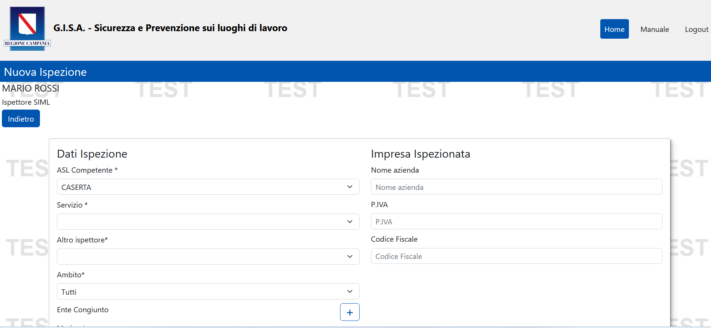
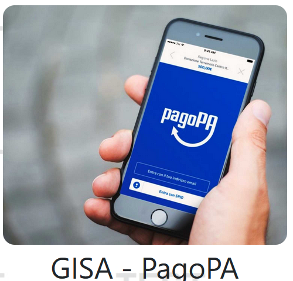
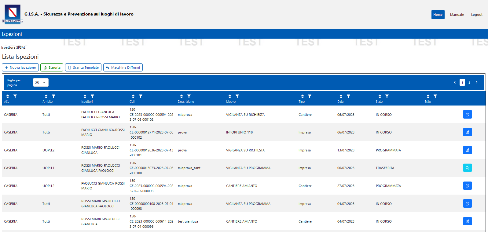
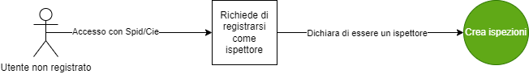

<p align="center">

</p>

# Ispezioni - G.I.S.A. Sicurezza e Prevenzione sui luoghi di lavoro
- [1. Descrizione e finalità del software](#1-descrizione-e-finalità-del-software)
  - [1.1 Descrizione della struttura repository](#11-descrizione-della-struttura-repository)
  - [1.2 Contesto di utilizzo e casi d'uso](#12-contesto-di-utilizzo-e-casi-duso)
  - [1.3 Piattaforme abilitanti](#13-piattaforme-abilitanti)
  - [1.4 Interoperabilità con i sistemi esterni](#14-interoperabilità-con-i-sistemi-esterni)
  - [1.5 Interoperabilità con i sistemi interni](#15-interoperabilità-con-i-sistemi-interni)
  - [1.6 Link a pagine istituzionali relative al progetto](#16-link-a-pagine-istituzionali-relative-al-progetto)
  - [1.7 Interfaccia web](#17-interfaccia-web)
- [2. Architettura del software](#2-architettura-del-software)
- [3. Requisiti](#3-requisiti)
  - [3.1 Tecnologie utilizzate lato server](#31-tecnologie-utilizzate-lato-server)
  - [3.2 Tecnologie utilizzate lato client](#32-tecnologie-utilizzate-lato-client)
- [4. Riuso ed installazione](#4-riuso-ed-installazione)
  - [4.1 Build dai sorgenti](#41-build-dai-sorgenti)
  - [4.2 Riuso nell'ambito della stessa regione](#42-riuso-nellambito-della-stessa-regione)
  - [4.3 Riuso per enti di altre regioni](#43-riuso-per-enti-di-altre-regioni)
  - [4.4 Librerie esterne](#44-librerie-esterne)
  - [4.5 Creazione e import database](#45-creazione-e-import-database)
  - [4.6 Templates configurazione](#46-templates-configurazione)
  - [4.7 Installazione in un ambiente di sviluppo](#47-Installazione-in-un-ambiente-di-sviluppo)
  - [4.8 Installazione in un ambiente di produzione](#48-Installazione-in-un-ambiente-di-produzione)
- [5. Licenza](#5-licenza)
  - [5.1 GISA Prevenzione e Sicurezza sui luoghi di lavoro](#51-Sicurezza-lavoro)
  - [5.2 Indirizzo e-mail segnalazioni di sicurezza](#52-indirizzo-e-mail-segnalazioni-di-sicurezza)
  - [5.3 Titolarità: Regione Campania](#53-titolarità-regione-campania)

# **1. Descrizione e finalità del software**
Nell’ottica della “Burocrazia zero” la Regione Campania ha reso disponibile un nuovo applicativo dedicato alla digitalizzazione del processo ispettivo presso cantieri e imprese finalizzato a garantire efficienza ed efficacia per contribuire alla sicurezza sui luoghi di lavoro.

Il software rappresenta un riferimento per l’utilizzo del servizio di “Ispezioni” e generazione degli “avvisi di pagamento PagoPA” relativi alla fase ispettiva su  cantieri e/o imprese tramite l’applicativo G.I.S.A. - Sicurezza e prevenzione sui luoghi di lavoro. L’applicativo è accessibile da qualsiasi browser e anche da dispositivi mobili. 
Presenta un’interfaccia responsive che si adatta a qualsiasi schermo.
Inoltre, viene fornito nella modalità PWA, che permette di scaricare l’applicativo direttamente sul proprio dispositivo mobile e accedervi direttamente dalla lista applicazioni. 
Questa funzionalità rende l’app completamente compatibile con tutti i moderni dispositivi, sia Android che iOS.


	

<p align="center">

</p>

 Figura 1.  Ispezioni
	
Questo modulo fornisce anche un app di generazione degli avvisi di Pagamento PagoPA da poter associare successivamente al verbale digitalizzato.
I direttori Servizio Igiene e Medicina del Lavoro (SIML) e Servizio prevenzione e Sicurezza Ambienti di Lavoro (SPSAL) e la regione, a seconda delle competenze e delle opportune     profilazioni, possono effettuare monitoraggi ed estrazione di reportistica.
 


<p align="center">

</p>

 Figura 2.  PagoPa


I Responsabili dei cantieri non necessitano della registrazione all'ecosistema GISA e possono inoltrare la notifica accedendo con SPID/CIE.


Sono presenti in **ISPEZIONI**  le tipologie di utenti della prevenzione e sicurezza sui luoghi di lavoro di seguito elencati e la gestione del workflow delle ispezioni sui luoghi di lavoro:

   -  Ispettori SIML delle AA.SS.LL.;
   -  Ispettori SPSAL delle AA.SS.LL.;
   -  Direttori SIML delle AA.SS.LL.;
   -  Direttori SPSAL delle AA.SS.LL.;
   -  Regione.


## **1.1 Descrizione della struttura repository**

  - _./database_   script sql per la creazione della struttura del DB 

  - _./docs_       documentazione varia (cartella contenente file integrati nel readme: immagini, diagrammi, ecc.)  

  - _./templates_   file template per la configurazione del sistema

  - _./ispezioni_    sorgenti e struttura di cartelle della piattaforma 


## **1.2 Contesto di utilizzo e casi d'uso**

 Il contesto di utilizzo e casi d'uso del Software sono descritti dettagliatamente nella [guida utente](https://gisasicurezzalavoro.regione.campania.it/assets/Manuale_GISA_Sicurezza_Lavoro_Ispezioni.pdf)
 
## **1.3 Piattaforme abilitanti**

Le piattaforme abilitanti sono:
    - **Autenticazione SPID/CIE**
	
## **1.4 Interoperabilità con i sistemi esterni**

1. **SPID / CIE Regione Campania**
	
## **1.5 Interoperabilità con i sistemi interni**
1. **Notifiche preliminari**
2. **PagoPA**
3. **Macchine Difformi**

 La cooperazione applicativa interna all’ecosistema ***G.I.S.A. Sicurezza e Prevenzione sui luoghi di lavoro*** avviene invece mediante ***microservices*** o ***DBI*** (***DataBase Interface***).


## **1.6 Link a pagine istituzionali relative al progetto**

- [GISA Prevenzione e Sicurezza sui luoghi di lavoro](https://gisasicurezzalavoro.regione.campania.it/)


## **1.7 Interfaccia web**

**Ispezioni** è dotato di un interfaccia web semplice e intuitiva.
Questa la form da cui è possbile inserire un ispezione oppure consultare la lista delle ispezioni già presenti: 




Figura 3. Rappresentazione form ispezione


# **2. Architettura del software**

L'architettura software cioè l'organizzazione di base del sistema, espressa dalle sue componenti, dalle relazioni tra di loro e con l'ambiente, e i principi che ne guidano il progetto e l'evoluzione.




Figura 5. Processo registrazione utenti per ispezioni


# **3. Requisiti**

## **3.1 Tecnologie utilizzate lato server**
 - [Node.js  >= 16.14](https://nodejs.org/it/)
 - [Angular  >= 13.2](https://angular.io/)
 - [Postgres  15.x ](https://www.postgresql.org/about/news/postgresql-15-released-2526/)
 
## **3.2 Tecnologie utilizzate lato client**
- [Windows](https://www.microsoft.com/it-it/software-download/) (dalla versione 10 in poi)
- **Portatile** e **Responsive** per il mobile.
- In fase di sviluppo le app per **Android** e **iOS**.


 

# **4. Riuso ed installazione**

## **4.1 Build dai sorgenti**

Tecnicamente **G.I.S.A. Sicurezza e Prevenzione sui luoghi di lavoro** è un'applicazione in architettura web sviluppata con linguaggi Javascript/Typescript secondo il pattern _MVC_ (model view controller).

Come le applicazioni di questo genere **G.I.S.A. Sicurezza e Prevenzione sui luoghi di lavoro** è quindi composta da un back-end in funzione di _Model_ (in questo caso l'_RDBMS_ Postgresql) 
una serie di risorse di front-end web (_Angular_) in funzione di _View_
e infine, lato back-end, un webserver _NodeJS_, con il suo framework _Express_.  

 
## 4.2 Riuso nell'ambito della stessa regione

Nell'ottica del risparmio e della razionalizzazione delle risorse è opportuno che gli enti che insistono sullo stesso territorio regionale utilizzino la modalità **Multi-Tenant** al fine di installare un unico sistema a livello regionale.


## **4.3 Riuso per enti di altre regioni**
Al fine di avvalersi dei benefici del riuso così come concepito dal **CAD** si chiede di notificarlo come indicato nel paragrafo 5.3 al fine di evitare sprechi e frammentazioni.

*Nota: Se lo scopo è avviare un processo di sviluppo per modificare la propria versione di **GISA Prevenzione e Sicurezza sui luoghi di lavoro**, potrebbe essere il caso di generare prima un proprio fork su GitHub e quindi clonarlo.*


## **4.4 Librerie esterne**

Le dipendenze necessarie sono autoinstallanti tramite NPM (Node Package Manager), il gestore di pacchetti ufficiale di NodeJS:

```
cd sicurezza_lavoro/NodeJsServer/
npm install
cd ../AngularClient/
npm install
```


## **4.5 Creazione e import database**


Assicurarsi che nel file di configurazione pg_hba.conf sia correttamente configurato l'accesso dell'IP del nodo Tomcat al database: 
```
 host         all         all       <ipapplicativo>       trust
```
```
systemctl reload postgresql.service
```

Creazione Database e import dello schema tramite i seguenti comandi, con _dbuser_ e _dbhost_ adeguatamente valorizzati :

```
psql -U <dbuser> -h <dbhost> -c "create database sicurezza_lavoro "
```

Posizionarsi nella directory _sicurezza_lavoro_ ed eseguire il comando: 

```
psql -U <dbuser> -h <dbhost> -d sicurezza_lavoro < database/sicurezzalavoro.sql
```


## **4.6 Templates configurazione**

Sotto la directory _./templates/NodeJsServer_ è presente il file template _config.js_ , da configurare ed inserire sotto la directory _./sicurezza_lavoro/NodeJsServer/config/_

la directory config deve essere creata con il comando: 

```
cd sicurezza_lavoro/NodeJsServer/
mkdir config
```


Sotto la directory _./templates/AngularClient_ è presente il file template _environment.ts_ (_environment.prod.ts_ per produzione), da configurare ed inserire sotto la directory _./sicurezza_lavoro/AngularClient/src/environments/_

la directory environments deve essere creata con il comando: 
```
cd sicurezza_lavoro/AngularClient/src/
mkdir environments
```


## **4.7 Installazione in un ambiente di sviluppo**

- Clonare il repository _ISPEZIONI_ (Vedi paragrafo: 4.3 Riuso per enti di altre regioni):

        git clone \
          --depth 1  \
          --filter=blob:none  \
          --sparse \
          https://github.com/regione-campania/Gisa_Prevenzione_e_Sicurezza_Lavoro \
        ;
        cd Gisa_Prevenzione_e_Sicurezza_Lavoro
        git sparse-checkout set ispezioni

Sarà creata la directory sicurezza_lavoro. Da qui in avanti si farà riferimento a questa directory chiamandola "directory base".
		
- Installare _Visual_  _Studio_ _Code_ disponibile al seguente indirizzo: https://code.visualstudio.com/ , e importare i due progetti _NodeJsServer_ e _AngularClient_ .

- Creare ed importare database (Vedi paragrafo: Creazione e import database )

- Configurare i templates (Vedi paragrafo: Templates configurazione)

- Installare dipendenze (Vedi paragrafo: Librerie esterne)

- Lanciare il server NodeJS:
```
cd sicurezza_lavoro/NodeJsServer/
node main.js
```


- Lanciare il client Angular in modalità sviluppatore:
```
cd sicurezza_lavoro/AngularClient/
ng serve 
```


## **4.8 Installazione in un ambiente di produzione**

- Clonare il repository _ISPEZIONI_ (Vedi paragrafo: 4.3 Riuso per enti di altre regioni):

      git clone \
          --depth 1  \
          --filter=blob:none  \
          --sparse \
          https://github.com/regione-campania/Gisa_Prevenzione_e_Sicurezza_Lavoro \
        ;
        cd Gisa_Prevenzione_e_Sicurezza_Lavoro
        git sparse-checkout set ispezioni
		
- Creare ed importare database (Vedi paragrafo: Creazione e import database )

- Configurare i templates (Vedi paragrafo: Templates configurazione)

- Installare dipendenze (Vedi paragrafo: Librerie esterne)

- Compilare il client Angular:
```
ng build --configuration=production
```

- Installare PM2 (https://pm2.keymetrics.io/)
```
npm install pm2 -g
```

- Lanciare il server NodeJS con PM2:
```
pm2 start main.js -i max --name sicurezzaLavoro --time --production
```


# **5. Licenza**

## **5.1 GISA Prevenzione e Sicurezza sui luoghi di lavoro**

Stato Software : Stabile

**Soggetti incaricati del mantenimento del progetto open source**

U.S. s.r.l. 
## **5.2 Indirizzo e-mail segnalazioni di sicurezza**
Ogni segnalazione di eventuali problemi di sicurezza o bug relativo al software presente in questo repository, va segnalato unicamente tramite e-mail agli indirizzi presente nel file security.txt disponibile a questo [link](http://www.gisacampania.it/.well-known/security.txt)

NOTA: Le segnalazioni non vanno inviate attraverso l'issue tracker pubblico ma devono essere inviate confidenzialmente agli indirizzi e-mail presenti nel security.txt.

Lo strumento issue tracker può essere utilizzato per le richieste di modifiche necessarie per implementare nuove funzionalità.

## **5.3 Titolarità: [Regione Campania](http://www.regione.campania.it/)**
Concesso in licenza a norma di: **AGPL versione 3**;

E' possibile utilizzare l'opera unicamente nel rispetto della Licenza.

Una copia della Licenza è disponibile al seguente indirizzo: <https://www.gnu.org/licenses/agpl-3.0.txt>

**NOTE:**

In caso di riuso, in toto o in parte di G.I.S.A. Sicurezza e Prevenzione sui luoghi di lavoro, è necessario notificare l'adozione in riuso tramite l'apertura di un ticket (o analogo meccanismo quale una pull request) in questo repository. Inoltre, al contempo per gli aspetti organizzativi utili a potenziare i benefici derivanti dalla pratica del riuso tra PP.AA., come la partecipazione alla **Cabina di regia** per la condivisione di eventuali modifiche/integrazioni o innovazioni, è necessario darne tempestiva comunicazione alle seguenti e-mail:

[paolo.sarnelli@regione.campania.it]() 

[cinzia.matonti@regione.campania.it]()	

Gli enti che aderiscono al riuso di GISA entreranno a far parte della Cabina di Regia per condividere e partecipare all'evoluzione di GISA insieme alle altre PP.AA.