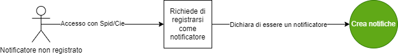

<p align="center">

</p>

# Notifiche preliminari - G.I.S.A. Sicurezza e Prevenzione sui luoghi di lavoro
- [1. Descrizione e finalità del software](#1-descrizione-e-finalità-del-software)
  - [1.1 Gestione notifiche](#11-gestione-notifiche)
  - [1.2 Descrizione della struttura repository](#12-descrizione-della-struttura-repository)
  - [1.3 Contesto di utilizzo e casi d'uso](#13-contesto-di-utilizzo-e-casi-duso)
  - [1.4 Piattaforme abilitanti](#14-piattaforme-abilitanti)
  - [1.5 Interoperabilità con i sistemi esterni](#15-interoperabilità-con-i-sistemi-esterni)
  - [1.6 Interoperabilità con i sistemi interni](#16-interoperabilità-con-i-sistemi-interni)
  - [1.7 Link a pagine istituzionali relative al progetto](#17-link-a-pagine-istituzionali-relative-al-progetto)
  - [1.8 Interfaccia web](#18-interfaccia-web)
- [2. Architettura del software](#2-architettura-del-software)
- [3. Requisiti](#3-requisiti)
  - [3.1 Tecnologie utilizzate lato server](#31-tecnologie-utilizzate-lato-server)
  - [3.2 Tecnologie utilizzate lato client](#32-tecnologie-utilizzate-lato-client)
- [4. Riuso ed installazione](#4-riuso-ed-installazione)
  - [4.1 Build dai sorgenti](#41-build-dai-sorgenti)
  - [4.2 Riuso nell'ambito della stessa regione](#42-riuso-nellambito-della-stessa-regione)
  - [4.3 Riuso per enti di altre regioni](#43-riuso-per-enti-di-altre-regioni)
  - [4.4 Librerie esterne](#44-librerie-esterne)
  - [4.5 Creazione e import database](#45-creazione-e-import-database)
  - [4.6 Templates configurazione](#46-templates-configurazione)
  - [4.7 Installazione in un ambiente di sviluppo](#47-Installazione-in-un-ambiente-di-sviluppo)
  - [4.8 Installazione in un ambiente di produzione](#48-Installazione-in-un-ambiente-di-produzione)
- [5. Licenza](#5-licenza)
  - [5.1 Sicurezza lavoro](#51-Sicurezza-lavoro)
  - [5.2 Indirizzo e-mail segnalazioni di sicurezza](#52-indirizzo-e-mail-segnalazioni-di-sicurezza)
  - [5.3 Titolarità: Regione Campania](#53-titolarità-regione-campania)

# **1. Descrizione e finalità del software**

Il sistema **G.I.S.A. Sicurezza e Prevenzione sui luoghi di lavoro**, nell’ottica della semplificazione amministrativa e dell’efficacia, efficienza ed economicità delle procedure, nasce al fine di informatizzare sia i processi coinvolti prima e durante le ispezioni dei cantieri di lavoro che le informazioni e i dati ad essi correlati utili alla prevenzione sanitaria e ad assicurare la compliance normativa. 
Il servizio digitale **Gestione notifiche**  è stato sviluppato per permettere a tutti soggetti, che ne hanno i requisiti in base all’art.99 Capo I del D. Lgs. 81/08, di redigere in modalità digitale la notifica preliminare relativa a un cantiere di lavoro e di trasmetterla automaticamente, tramite il sistema GISA, alle AA.SS.LL. territorialmente competenti senza necessità di ulteriori comunicazioni verso le aziende sanitarie.
Il sistema può essere configurato per la comunicazione anche agli Enti bilaterali e all’Ispettorato del lavoro delle notifiche preliminari di competenza.


***1) Gestione Notifiche Preliminari.***.

Consente la gestione delle Notifiche Preliminari, ai sensi dell’Art. 99 Capo I del D. Lgs. 81/08. Esso può essere utilizzato:

**dal Committente o dal Responsabile dei lavori** del Cantiere con personale superiore a tre lavoratori
che, in accordo all’Art. 99 Capo I del D. Lgs. 81/08 e attraverso una web application utilizzabile anche da smartphone, può compilare on line la notifica preliminare dell’apertura del Cantiere e inviarla automaticamente, previo accordo e opportuna configurazione, agli organi di vigilanza competenti in materia: le AA.SS.LL. e l’Ispettorato del Lavoro;

**dall’ASL e dall’Ispettorato del Lavoro** territorialmente competenti,
per conoscere in tempo reale le Notifiche Preliminari di apertura dei Cantieri al fine di facilitare e digitalizzare il monitoraggio e lo svolgimento delle attività ispettive, di vigilanza e di prevenzione di competenza;

**dalla Regione**
per poter disporre di un cruscotto atto a semplificare le proprie attività istituzionali;

**dagli Enti Bilaterali (Comitati Paritetici e Casse Edili),**
che potrebbero conoscere in tempo reale le notifiche preliminari effettuate con conseguenti vantaggi nelle verifiche di congruità assicurative e contributive (DURC) e nel contrasto in maniera più efficace del lavoro irregolare nel settore edile (Legge Regionale n. 6 del 2016, art. 21).


<p align="center">

</p>

  Figura 1.  Notifiche preliminari


## 1.1 Gestione notifiche

Il sistema è **multi-browser** e **responsive** quindi in grado di adattarsi graficamente in modo automatico al dispositivo con il quale viene utilizzato
(computer con diverse risoluzioni, tablet, smartphone, ecc), riducendo al massimo la necessità dell'utente di ridimensionare e scorrere i contenuti.

Di seguito alcuni screenshot del sistema:


Figura 2. Home Notifiche preliminari


Figura 3. Visualizzazione in versione mobile dell'applicativo


Il sistema **G.I.S.A. Sicurezza e Prevenzione sui luoghi di lavoro** fa parte dell'Ecosistema GISA.


Profili disponibili:

- **Profilo Notificatore**


## **1.2 Descrizione della struttura repository**

  - _./database_   script sql per la creazione della struttura del DB 

  - _./docs_       documentazione varia (cartella contenente file integrati nel readme: immagini, diagrammi, ecc.)  

  - _./templates_   file template per la configurazione del sistema

  - _./notifiche_preliminari_    sorgenti e struttura di cartelle della piattaforma 


## **1.3 Contesto di utilizzo e casi d'uso**

 Il contesto di utilizzo e casi d'uso del Software sono descritti dettagliatamente nella [guida utente](https://sca.gisacampania.it/sicurezzalavoro/Manuale_GISA_Sicurezza_Lavoro.pdf)
 
## **1.4 Piattaforme abilitanti**

Le piattaforme abilitanti sono:
    - **Autenticazione SPID/CIE**
	
## **1.5 Interoperabilità con i sistemi esterni**
	
1. **SPID / CIE Regione Campania**	
	
	
	
## **1.6 Interoperabilità con i sistemi interni**

1. **Ispezioni**
	


## **1.7 Link a pagine istituzionali relative al progetto**

- [GISA Prevenzione e Sicurezza sui luoghi di lavoro](https://sca.gisacampania.it/sicurezzalavoro/)


## **1.8 Interfaccia web**

**G.I.S.A. Sicurezza e Prevenzione sui luoghi di lavoro** è dotato di un interfaccia web semplice e intuitiva.
Questa la form di creazione notifica: 


Figura 4. Rappresentazione form notifica


# **2. Architettura del software**

L'architettura software cioè l'organizzazione di base del sistema, espressa dalle sue componenti, dalle relazioni tra di loro e con l'ambiente, e i principi che ne guidano il progetto e l'evoluzione.




Figura 5. Processo registrazione utenti notificatori


# **3. Requisiti**

## **3.1 Tecnologie utilizzate lato server**
 - [Node.js  >= 16.14](https://nodejs.org/it/)
 - [Angular  >= 13.2](https://angular.io/)
 - [Postgres  15.x ](https://www.postgresql.org/about/news/postgresql-15-released-2526/)
 
## **3.2 Tecnologie utilizzate lato client**
- [Windows](https://www.microsoft.com/it-it/software-download/) (dalla versione 10 in poi)
- **Portatile** e **Responsive** per il mobile.
- In fase di sviluppo le app per **Android** e **iOS**.


 

# **4. Riuso ed installazione**

## **4.1 Build dai sorgenti**

Tecnicamente **G.I.S.A. Sicurezza e Prevenzione sui luoghi di lavoro** è un'applicazione in architettura web sviluppata con linguaggi Javascript/Typescript secondo il pattern _MVC_ (model view controller).

Come le applicazioni di questo genere **G.I.S.A. Sicurezza e Prevenzione sui luoghi di lavoro** è quindi composta da un back-end in funzione di _Model_ (in questo caso l'_RDBMS_ Postgresql) 
una serie di risorse di front-end web (_Angular_) in funzione di _View_
e infine, lato back-end, un webserver _NodeJS_, con il suo framework _Express_.  

 
## 4.2 Riuso nell'ambito della stessa regione

Nell'ottica del risparmio e della razionalizzazione delle risorse è opportuno che gli enti che insistono sullo stesso territorio regionale utilizzino la modalità **Multi-Tenant** al fine di installare un unico sistema a livello regionale.


## **4.3 Riuso per enti di altre regioni**
Al fine di avvalersi dei benefici del riuso così come concepito dal **CAD** si chiede di notificarlo come indicato nel paragrafo 5.3 al fine di evitare sprechi e frammentazioni.

*Nota: Se lo scopo è avviare un processo di sviluppo per modificare la propria versione di **G.I.S.A. Sicurezza e Prevenzione sui luoghi di lavoro**, potrebbe essere il caso di generare prima un proprio fork su GitHub e quindi clonarlo.*

Eseguire il seguente comando:

        git clone \
          --depth 1  \
          --filter=blob:none  \
          --sparse \
          https://github.com/regione-campania/Gisa_Prevenzione_e_Sicurezza_Lavoro \
        ;
        cd Gisa_Prevenzione_e_Sicurezza_Lavoro
        git sparse-checkout set notifiche_preliminari

Sarà creata la directory notifiche_preliminari. Da qui in avanti si farà riferimento a questa directory chiamandola "directory base".


## **4.4 Librerie esterne**

Le dipendenze necessarie sono autoinstallanti tramite NPM (Node Package Manager), il gestore di pacchetti ufficiale di NodeJS:

```
cd notifiche_preliminari/NodeJsServer/
npm install
cd ../AngularClient/
npm install
```


## **4.5 Creazione e import database**


Assicurarsi che nel file di configurazione pg_hba.conf sia correttamente configurato l'accesso dell'IP del nodo Tomcat al database: 
```
 host         all         all       <ipapplicativo>       trust
```
```
systemctl reload postgresql.service
```

Creazione Database e import dello schema tramite i seguenti comandi, con _dbuser_ e _dbhost_ adeguatamente valorizzati :

```
psql -U <dbuser> -h <dbhost> -c "create database notifiche_preliminari "
```

Posizionarsi nella directory _notifiche_preliminari_ ed eseguire il comando: 

```
psql -U <dbuser> -h <dbhost> -d notifiche_preliminari < database/sicurezzalavoro.sql
```


## **4.6 Templates configurazione**

Sotto la directory _./templates/NodeJsServer_ è presente il file template _config.js_ , da configurare ed inserire sotto la directory _./notifiche_preliminari/NodeJsServer/config/_

la directory config deve essere creata con il comando: 

```
cd notifiche_preliminari/NodeJsServer/
mkdir config
```


Sotto la directory _./templates/AngularClient_ è presente il file template _environment.ts_ (_environment.prod.ts_ per produzione), da configurare ed inserire sotto la directory _./notifiche_preliminari/AngularClient/src/environments/_

la directory environments deve essere creata con il comando: 
```
cd notifiche_preliminari/AngularClient/src/
mkdir environments
```


## **4.7 Installazione in un ambiente di sviluppo**

- Clonare il repository _notifiche_preliminari_ (Vedi paragrafo: 4.3 Riuso per enti di altre regioni):

        git clone https://github.com/regione-campania/Gisa_Prevenzione_e_Sicurezza_Lavoro/notifiche_preliminari \   
		
- Installare _Visual_  _Studio_ _Code_ disponibile al seguente indirizzo: https://code.visualstudio.com/ , e importare i due progetti _NodeJsServer_ e _AngularClient_ .

- Creare ed importare database (Vedi paragrafo: Creazione e import database )

- Configurare i templates (Vedi paragrafo: Templates configurazione)

- Installare dipendenze (Vedi paragrafo: Librerie esterne)

- Lanciare il server NodeJS:
```
cd notifiche_preliminari/NodeJsServer/
node main.js
```


- Lanciare il client Angular in modalità sviluppatore:
```
cd notifiche_preliminari/AngularClient/
ng serve 
```


## **4.8 Installazione in un ambiente di produzione**

- Clonare il repository _notifiche_preliminari_ (Vedi paragrafo: 4.3 Riuso per enti di altre regioni):

        git clone \
          --depth 1  \
          --filter=blob:none  \
          --sparse \
          https://github.com/regione-campania/Gisa_Prevenzione_e_Sicurezza_Lavoro \
        ;
        cd Gisa_Prevenzione_e_Sicurezza_Lavoro
        git sparse-checkout set notifiche_preliminari
		
- Creare ed importare database (Vedi paragrafo: Creazione e import database )

- Configurare i templates (Vedi paragrafo: Templates configurazione)

- Installare dipendenze (Vedi paragrafo: Librerie esterne)

- Compilare il client Angular:
```
ng build --configuration=production
```

- Installare PM2 (https://pm2.keymetrics.io/)
```
npm install pm2 -g
```

- Lanciare il server NodeJS con PM2:
```
pm2 start main.js -i max --name sicurezzaLavoro --time --production
```


# **5. Licenza**

## **5.1 Sicurezza lavoro**

Stato Software : Stabile

**Soggetti incaricati del mantenimento del progetto open source**

U.S. s.r.l. 
## **5.2 Indirizzo e-mail segnalazioni di sicurezza**
Ogni segnalazione di eventuali problemi di sicurezza o bug relativo al software presente in questo repository, va segnalato unicamente tramite e-mail agli indirizzi presente nel file security.txt disponibile a questo [link](http://www.gisacampania.it/.well-known/security.txt)

NOTA: Le segnalazioni non vanno inviate attraverso l'issue tracker pubblico ma devono essere inviate confidenzialmente agli indirizzi e-mail presenti nel security.txt.

Lo strumento issue tracker può essere utilizzato per le richieste di modifiche necessarie per implementare nuove funzionalità.

## **5.3 Titolarità: [Regione Campania](http://www.regione.campania.it/)**
Concesso in licenza a norma di: **AGPL versione 3**;

E' possibile utilizzare l'opera unicamente nel rispetto della Licenza.

Una copia della Licenza è disponibile al seguente indirizzo: <https://www.gnu.org/licenses/agpl-3.0.txt>

**NOTE:**

In caso di riuso, in toto o in parte, dell'ecosistema software G.I.S.A. Sicurezza e Prevenzione sui luoghi di lavoro, è necessario notificare l'adozione in riuso tramite l'apertura di un ticket (o analogo meccanismo quale una pull request) in questo repository. Inoltre, al contempo per gli aspetti organizzativi utili a potenziare i benefici derivanti dalla pratica del riuso tra PP.AA., come la partecipazione alla **Cabina di regia** per la condivisione di eventuali modifiche/integrazioni o innovazioni, è necessario darne tempestiva comunicazione alle seguenti e-mail:

[paolo.sarnelli@regione.campania.it]() 

[cinzia.matonti@regione.campania.it]()	

Gli enti che aderiscono al riuso di GISA entreranno a far parte della Cabina di Regia per condividere e partecipare all'evoluzione di GISA insieme alle altre PP.AA.